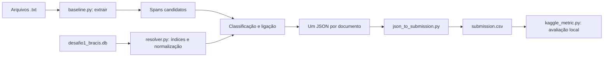

# Extração e validação de citações jurídicas

Este projeto lê peças jurídicas em `.txt`, encontra citações, consulta uma base SQLite de documentos canônicos e gera o CSV de submissão do desafio BRACIS/Jusbrasil. O pipeline principal é **regex + índices em memória construídos a partir do SQLite**. Não há LLM nem modelo treinado na inferência. O experimento com TF-IDF existe, mas não entrou na submissão principal.

## Contrato do problema

Para cada citação, precisamos devolver um intervalo `[inicio, fim)` no texto original, uma classe (`real`, `inventada` ou `incompleta`) e, se for `real`, o `id_canonico` correspondente. Os offsets são posições de caracteres Python no arquivo UTF-8; por isso a leitura preserva as quebras de linha e o trecho extraído deve satisfazer `texto[inicio:fim] == trecho`.

- `files/txt/`: 26 textos originais, um arquivo por documento.
- `files/goldenset_offsets.csv`: 192 citações anotadas nesses textos.
- `files/desafio1_bracis.db`: catálogo de documentos canônicos usado para confirmar citações reais.
- `dataset_extra/dataset.xlsx` e `dataset_extra/txt/`: anotações e textos adicionais para avaliação local. A pasta é ignorada pelo Git.

## Arquitetura



1. **Extração:** `baseline.py` aplica regex para processos, súmulas, temas, artigos de lei e algumas referências descritivas. Elimina sobreposições e ignora o cabeçalho sintético quando encontra o separador `\n\n\n`. A opção `--vagas` acrescenta padrões para referências sem número identificador, frequentes no conjunto extra. Com `--vagas --refinar-vagas`, ajusta os limites dessas referências e evita que `decisão recorrida` consuma uma referência legal seguinte.
2. **Resolução:** `resolver.py` abre o SQLite em modo somente leitura, percorre a tabela `documentos` e monta índices para números de processos, súmulas e pares `(artigo, fonte da lei)`. Normaliza pontuação, siglas e confusões comuns de OCR nos números. Uma chave só vira ligação quando aponta para um único ID.
3. **Classificação:** ligação única → `real`; referência sem chave suficiente ou com múltiplos IDs possíveis → `incompleta`; chave completa sem registro no banco → `inventada`. Uma extração marcada como vaga é `incompleta`. Essa última regra depende da cobertura do banco: uma citação real ausente dele pode acabar classificada como `inventada`.
4. **Saída:** `predict` grava os JSONs em `runs/predicoes/` e chama `files/json_to_submission.py`. O CSV tem as colunas `documento_id,citacoes`; cada citação usa `inicio,fim,classe,id_canonico,confianca`, e várias citações são separadas por `|`. O campo ausente é `-`. O código hoje envia `confianca=1.0` para todas as previsões: é um valor fixo, **não uma probabilidade calibrada**.

`data_utils.py` audita o conjunto original; `extra_eval.py` avalia o conjunto extra; `tfidf_experiment.py` compara, em separado, um filtro de candidatos com TF-IDF de caracteres e regressão logística. `runs/` guarda CSVs e relatórios locais e também é ignorada pelo Git.

## Como rodar

Use Python 3.10+ na raiz do repositório:

```bash
python3 -m venv .venv
.venv/bin/python -m pip install -r requirements.txt
```

Para gerar e avaliar a submissão padrão nos 26 documentos originais:

```bash
.venv/bin/python data_utils.py
.venv/bin/python baseline.py predict
.venv/bin/python baseline.py score --split todos
```

O arquivo para envio é `runs/submission.csv`. O comando `score` lê o gabarito **local**, não consulta o Kaggle. Para inspecionar as etapas isoladamente:

```bash
.venv/bin/python baseline.py extract
.venv/bin/python baseline.py eval-extraction --split todos
.venv/bin/python baseline.py resolve --split todos
.venv/bin/python test_baseline.py
.venv/bin/python test_resolver.py
```

`extract` grava `runs/candidatos.jsonl`; `eval-extraction` mede apenas os spans; `resolve` usa os spans do gabarito para medir a ligação sem misturar erros de extração. Os relatórios ficam em `runs/`.

Para reproduzir a avaliação do conjunto extra, é preciso ter `dataset_extra/` no disco:

```bash
.venv/bin/python extra_eval.py --split desenvolvimento --vagas --report runs/extra_dev_repro.json
.venv/bin/python extra_eval.py --split teste --vagas --report runs/extra_test_repro.json
```

Para comparar com o refinamento, mantendo o mesmo resolvedor:

```bash
.venv/bin/python extra_eval.py --split desenvolvimento --vagas --refinar-vagas --report runs/extra_dev_refinado.json
.venv/bin/python extra_eval.py --split teste --vagas --refinar-vagas --report runs/extra_test_refinado.json
```

O modo padrão de `predict` usa as regex estritas. Para testar o modo amplo em outra pasta de `.txt`, mantenha os artefatos separados:

```bash
.venv/bin/python baseline.py predict --input caminho/para/txt --vagas \
  --output runs/predicoes_amplas --submission runs/submission_ampla.csv
```

Para usar os spans refinados no conjunto extra:

```bash
.venv/bin/python baseline.py predict --input dataset_extra/txt --vagas --refinar-vagas \
  --output runs/predicoes_refinadas --submission runs/submission_refinada.csv
```

`--refinar-vagas` exige `--vagas`. Sem essa opção, o modo amplo conserva os spans anteriores. Use referências vagas quando a avaliação inclui essas referências: no conjunto original, o modo amplo também encontra referências sem anotação que geram falsos positivos. O modo estrito continua sendo o padrão.

`predict` lê apenas os `.txt` diretamente na pasta indicada; não percorre subpastas. A pasta de JSONs de saída deve conter somente documentos daquela execução, pois o comando rejeita JSONs antigos de outros documentos.

## Como o score é calculado

A métrica fornecida pelo desafio, em `files/kaggle_metric.py`, casa spans um a um com IoU ≥ 0,5. Calcula macro-F1 das três classes por nível, exige ID correto para `real`, penaliza citações `inventada` chamadas de `real` e dá peso 2 ao nível 2. Há ainda um bônus de até 10% ligado ao erro de Brier das confianças informadas. Por isso o score pode ultrapassar `1,0`, e o F1 de extração não é o mesmo número que o score final.

## Resultados registrados

**Conjunto** significa *em quais textos medimos*. **Versão** significa *quais regras de extração usamos*. São eixos diferentes: podemos executar regras antigas e novas nos mesmos textos e comparar os scores.

- **Original:** os 26 documentos de `files/txt/`, com 192 citações anotadas. Esse conjunto foi usado durante o ajuste do código; seu score mostra que reproduzimos a amostra conhecida, não que generalizamos para textos novos.
- **Extra:** os textos e as anotações de `dataset_extra/`. Há 134 documentos na planilha; 40 foram descartados porque têm spans que não batem com o texto. Os 94 válidos foram divididos por documento em **81 de desenvolvimento** (para analisar erros e ajustar regex) e **13 de teste** (reservados para avaliar as regras depois dos ajustes). A lista está em `extra_split.json`.
- **Regras antigas:** estado do baseline antes de ampliar as regex. **Regras atuais estritas:** código atual sem `--vagas`. **Regras atuais amplas:** mesmo código com `--vagas`, que também procura referências sem número.

Nos **26 documentos originais**, as regras atuais no modo padrão encontraram as 192 citações, sem erros de span, classe ou ligação. O score local com `confianca=1.0` foi **1,1000**. Como esse conjunto guiou ajustes, esse resultado não é uma estimativa independente de desempenho.

No **conjunto extra**, comparamos as regras nos *mesmos documentos de cada divisão*:

| Textos avaliados | Regras | F1 da extração | Score sem confiança | Score com confiança 1,0 |
| --- | --- | ---: | ---: | ---: |
| 81 de desenvolvimento | antigas | 0,7028 | 0,5944 | 0,6520 |
| 81 de desenvolvimento | atuais amplas | 0,9685 | 0,9342 | 1,0247 |
| 81 de desenvolvimento | amplas refinadas | 0,9819 | 0,9511 | 1,0433 |
| 13 de teste | antigas | 0,7556 | 0,5287 | 0,5761 |
| 13 de teste | atuais estritas | 0,8414 | 0,6263 | 0,6838 |
| 13 de teste | atuais amplas | 0,9467 | 0,8577 | 0,9382 |
| 13 de teste | amplas refinadas | **0,9586** | **0,8788** | **0,9615** |

As linhas de regras antigas são resultados históricos salvos em `runs/`; o código atual executa apenas as regras atuais.

O refinamento altera apenas a extração: no desenvolvimento, TP/FP/FN passaram de `477/21/10` para `487/18/0`; no teste, de `80/6/3` para `81/5/2`. O score sem confiança aumentou de `0,857671` para `0,878835` no teste, com o resolvedor original. É um ganho medido localmente; os 13 documentos de teste são poucos para garantir generalização. As referências vagas continuam `incompleta`, sem ID, e o modo estrito mantém seu resultado nos 26 documentos originais.

Por exemplo, nos 13 textos de teste, o score **sem confiança** subiu de 0,5287 com as regras antigas para 0,8577 com as atuais amplas. Esse score inclui extração, classe e ligação; o F1 da tabela mede só a extração. Todos os números são de **avaliação local** em `runs/`, não do placar atual do Kaggle. A antiga reserva de 20 documentos do experimento TF-IDF já tinha sido examinada e entrou no desenvolvimento; ela não é um segundo teste independente.

As 5.000 peças de `dataset_extra/dataset_compartilhado/` foram percorridas para observar variações de escrita e volume. Seus rótulos são **por documento**, sem offsets por citação, então não fornecem precisão/recall de extração.

O filtro TF-IDF foi testado antes da ampliação das regex. Na antiga reserva extra de 20 documentos, o score sem confiança foi `0,6758` com regex e `0,6755` com o filtro; ele removeu tanto um falso positivo quanto uma citação correta. Como o problema dominante era falta de candidatos, a mudança aplicada ao pipeline foi ampliar a extração. O experimento continua disponível em `tfidf_experiment.py`, mas não altera `predict`.

O modo amplo aumenta bastante o recall no conjunto extra, mas ainda produz falsos positivos e erra algumas classes/ligações. IDs reais ausentes do SQLite e números que apontam para mais de um registro limitam o resolvedor. Como a confiança fixa não representa esses riscos, compare primeiro o **score sem confiança** ao avaliar mudanças e trate o bônus como parte da regra da competição, não como evidência de calibração.
